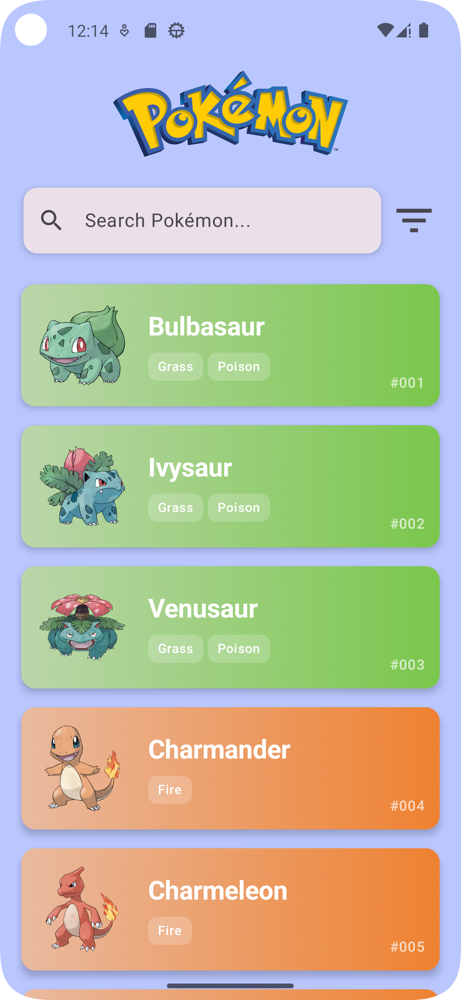
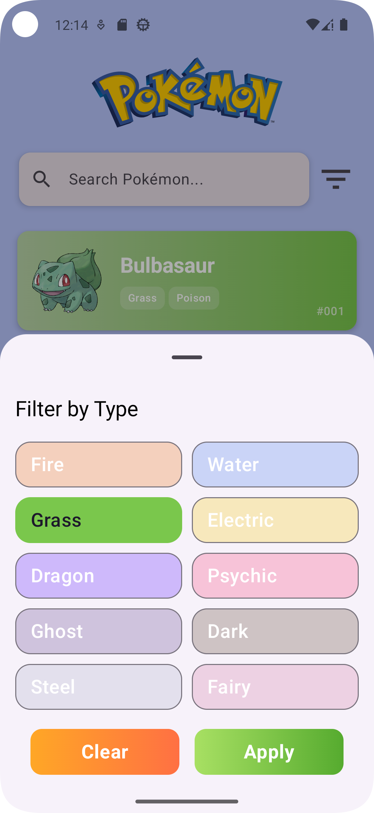
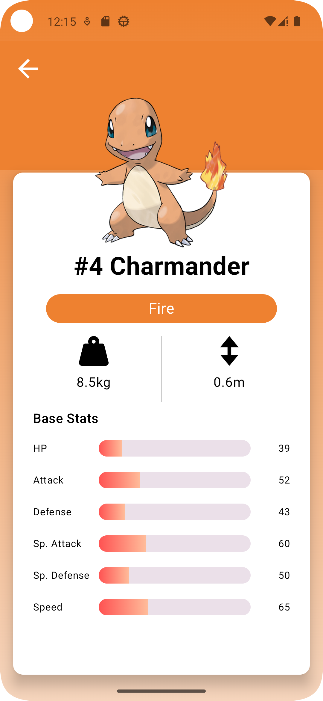
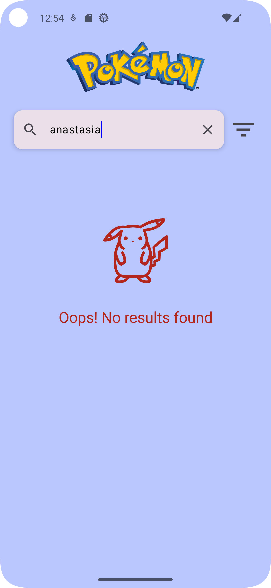
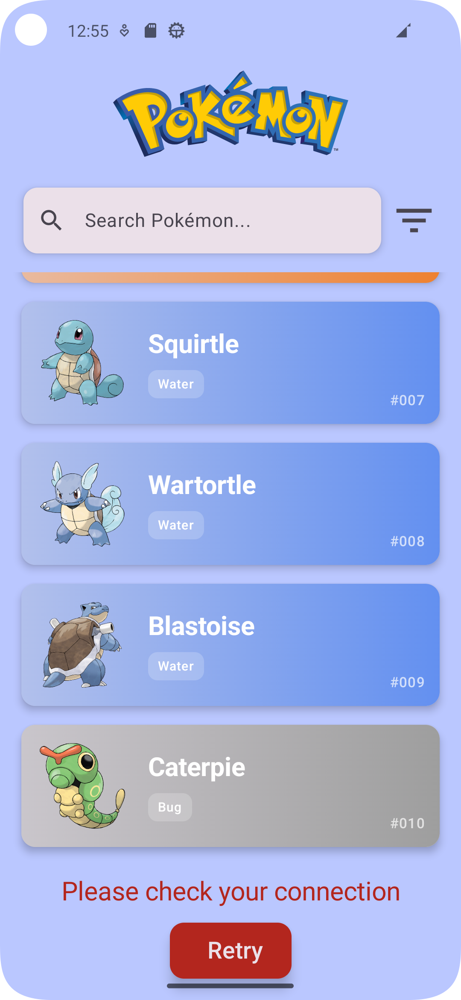

# 🧭 Pokémon Explorer App

A simple and elegant Pokémon Explorer mobile application built with [Jetpack Compose](https://developer.android.com/jetpack/compose), using [PokéAPI](https://pokeapi.co/) to explore Pokémon by type or name.

## ✨ Features

- 🔍 **Search Pokémon by Name**
    - Supports searching across all Pokémon or filtered by type.
    - Search state is preserved across navigation.

- 🧪 **Filter by Type**
    - Filter Pokémon by one of the 10 specified types:
        - Fire, Water, Grass, Electric, Dragon, Psychic, Ghost, Dark, Steel, Fairy.
    - Current filter is visually highlighted and remembered across screen transitions.

- 📋 **List View**
    - Paginated Pokémon list (10 at a time) with "Load More" functionality.
    - Smooth lazy column scrolling experience.

- 📄 **Details Screen**
    - View detailed Pokémon information:
        - Name, image, stats (HP, Attack, Defense).
    - Background color based on the dominant Pokémon type.

- ⚠️ **Error Handling**
    - Friendly error messages when something goes wrong.
    - Retry mechanism included for network-related issues.
    - Automatically retries when network becomes available again.

- 🌐 **Connectivity Awareness**
    - Monitors network state and attempts auto-retry for failed fetches due to connectivity.

## 📲 Screenshots

| Home | Type Filter | Pokémon Details | Search                            |
|------|-------------|------------------|-----------------------------------|
|  |  |  |  |

| Not Found Error                    | Connection Error                            |
|------------------------------------|---------------------------------------------|
|  |  |


## 📦 Installation

To run the app on your Android device:

1. Clone the repository:
   ```bash
   https://github.com/anastasiamela/PokeData.git

2. To Build an APK

**From Android Studio:**

Build > Build Bundle(s) / APK(s) > Build APK(s)

Then locate the APK from the build notification and install/share it on your device.

## 📦 API Reference

This app uses [PokéAPI](https://pokeapi.co/) to fetch:
- Pokémon list by type
- Pokémon details
